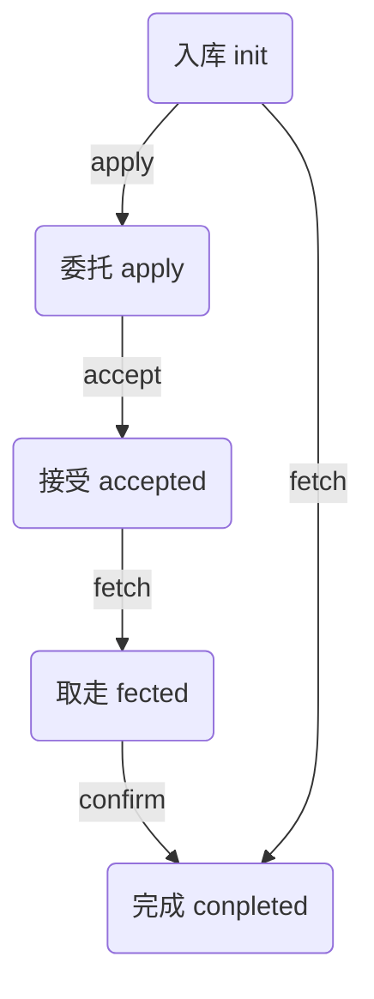

# API_DOC

## 包裹状态变化

(线内内容表示payload)



## address与state

地址生成方法（python）

```python
    PC_NAMESPACE = hashlib.sha512('pacel_chain'.encode("utf-8")).hexdigest()[0:6]

    USER_NAMEPCACE = hashlib.sha512('user_state'.encode("utf-8")).hexdigest()[0:4]
    ODER_NAMESPACE = hashlib.sha512('oder_state'.encode("utf-8")).hexdigest()[0:4]


    CONFIG_ADDRESS = PC_NAMESPACE

    def make_user_address(public_key):
        return PC_NAMESPACE + USER_NAMEPCACE + public_key[-60:]

    def make_oder_address(oder_number):
        return PC_NAMESPACE + ODER_NAMESPACE + hashlib.sha512(oder_number.encode("utf-8")).hexdigest()[-60:]

    def make_station_adress(station):
        return PC_NAMESPACE + hashlib.sha512(station.encode('utf-8')).hexdigest()[-64:]

    def make_mobile_adress(mobile):
        return PC_NAMESPACE + hashlib.sha512(mobile.encode('utf-8')).hexdigest()[-64:]


    SETTING_ADDRESS = PC_NAMESPACE + "0000000000000000000000000000000000000000000000000000000000000000"
```

五种地址分别为:  

#### user adress用户地址

纪录用户的电话号码和余额

例：
    
    {"key": "02897f17d3d6f0ba1feafb9e28c26a78e883e2df10ca33898dc7f87c2442678239", "coin": 80, "mobile": "13160606060"}

#### order address订单地址

记录订单相关信息

例：

委托的订单：
    
    {"order_number": "001", "state": "completed", "destionation": "nanyuan", "station": "beiyuan", "acceptor": "02578bdf3129a20403071afd1161385f224d028a4f4fe7736285b99633a8691d29", "coin": 20, "pacel_number": "10-10-10"}

未委托的订单（自己取走）：
    
    {"order_number": "002", "state": "completed", "station": "beiyuan", "pacel_number": "10-10-11"}

#### station address驿站地址
记录驿站管理员公钥

例：

    {"keys": ["039cdbd9c35f2e668375c9eab2df59fd0335d8ad6ee1b0f12192109317c3b36e7c"]}

#### mobile address电话地址
记录该号码对应的订单，包括接受的订单

例：

    {"order_number": ["002"], "accepted_order_number": ["001"]}

#### setting address 设置地址

记录一些设置


## 角色及功能
（注意，发送交易是，payload以encode后的字符串格式，input和output为字符串数组，一下的input output是指用户，商店，设置，订单，电话的相关地址）

### 管理员

拥有初始100000000金币，可以对金币进行分配，可以为驿站设置驿站管理员


#### init 管理员注册

payload示例：

    {'action':'init'}

input，output：管理员的用户地址，设置地址


#### authorize驿站管理员授权

一个驿站可以有多个管理员

payload示例：

    {'action':'authorize',
    'pub_key':s01_pub,
    'station':'beiyuan'}

input，output：设置地址，驿站地址

### 驿站管理员

可以入库包裹

#### warehouse入库
payload示例： 

    {'action':'warehouse',
    'station':'beiyuan',
    'pacels':
            [{'mobile':'13160606060','order_number':'001','pacel_number':'10-10-10'},
                {'mobile':'13160606070','order_number':'002','pacel_number':'10-10-11'}]
    }
    
input，output：驿站地址，所有订单地址，所有电话号码相关地址


#### 普通用户

可以直接取走已经入库的包裹，对已经入库的包裹发起委托，接受委托，取走委托包裹，确认交易完成


#### apply将入库的订单进行委托
payload示例： 

    {'action':'apply',
    'order_number':'001',
    'coin':20,
    'destination':'nanyuan'}

input，output：委托方用户相关地址，订单相关地址，电话号码相关地址


#### accept接受订单
payload示例： 
    
    {'action':'accept'
    ,'order_number':'001'}
    
input，output：接受方用户相关地址，接收方电话相关地址，订单相关地址


#### fetch取货
payload示例：
    
    {'action':'fetch',
    'order_number':'002'}

input，output：
    1.    取自己的包裹：订单号地址,电话号码地址
    2.    取受委托的包裹: 订单号地址


#### confirm确认
payload示例：
    
    {'action':'confirm',
    'order_number':'001'}
input，output：,自己的用户地址,订单号地址,受委托方用户地址,电话号码地址


